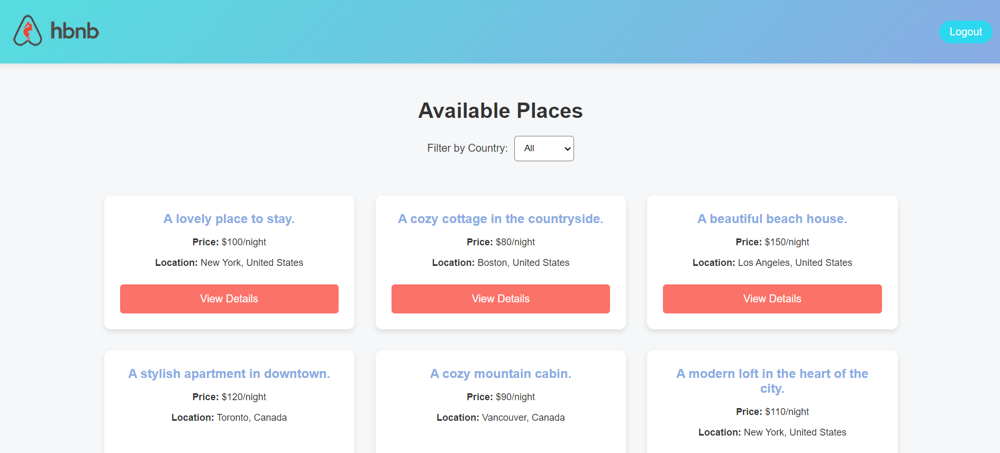
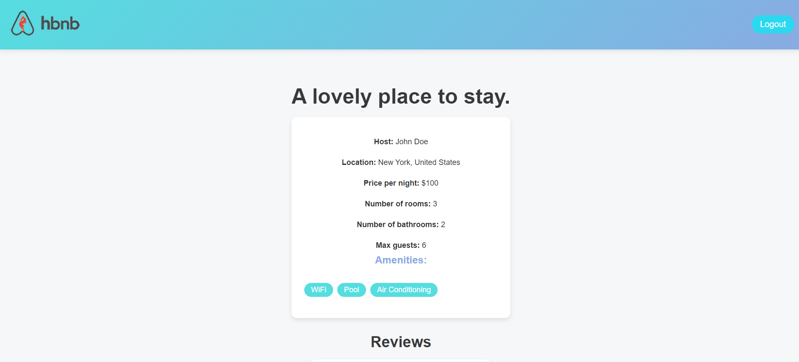

# HBnB Client

## Author: Xavier J. Cruz

## Project Overview

HBnB-Client is a web application that allows users to login/logout, browse, and review accommodation listings. This project includes both a backend API and frontend HTML, CSS, Javascript.




## Project Structure

```
├── README.md
├── base_files
│   ├── add_review.html
│   ├── icon.png
│   ├── icon_bath.png
│   ├── icon_bed.png
│   ├── icon_wifi.png
│   ├── index.html
│   ├── login.html
│   ├── logo.png
│   ├── place.html
│   ├── scripts.js
│   └── styles.css
├── hbnb_index.png
├── mock-api
│   ├── README.md
│   ├── app.py
│   ├── config.py
│   ├── data
│   │   ├── cities.json
│   │   ├── countries.json
│   │   ├── places.json
│   │   └── users.json
```

## Backend (Flask API)

The backend is built with Flask and provides the following endpoints:

- `POST /login`: User authentication
- `GET /places`: List all places
- `GET /places/{id}`: Get details of a specific place
- `POST /places/{id}/reviews`: Add a review for a place (requires authentication)

### Setup and Running

1. Create a virtual environment:
   ```
   python -m venv venv
   ```

2. Activate the virtual environment:
   - Windows: `venv\Scripts\activate`
   - macOS/Linux: `source venv/bin/activate`

3. Install dependencies:
   ```
   pip install -r requirements.txt
   ```

4. Run the Flask server:
   ```
   python app.py
   ```

The server will start at `http://127.0.0.1:5000`.

## Frontend (HTML Templates)

The frontend consists of HTML templates for the following pages:

- `index.html`: Home page with a list of available places
- `login.html`: User login page
- `place.html`: Detailed view of a specific place
- `add_review.html`: Form to add a review for a place

## Data

The application uses JSON files to store data:

- `places.json`: Accommodation listings
- `users.json`: User information
- `cities.json`: City data
- `countries.json`: Country data

## Features

- User authentication
- Browsing accommodation listings
- Viewing detailed information about a place
- Adding reviews for places (authenticated users only)
- Filtering places by country

## Security Note

This project uses plain text passwords for simplicity. In a production environment, always use hashed passwords and implement proper security measures.

